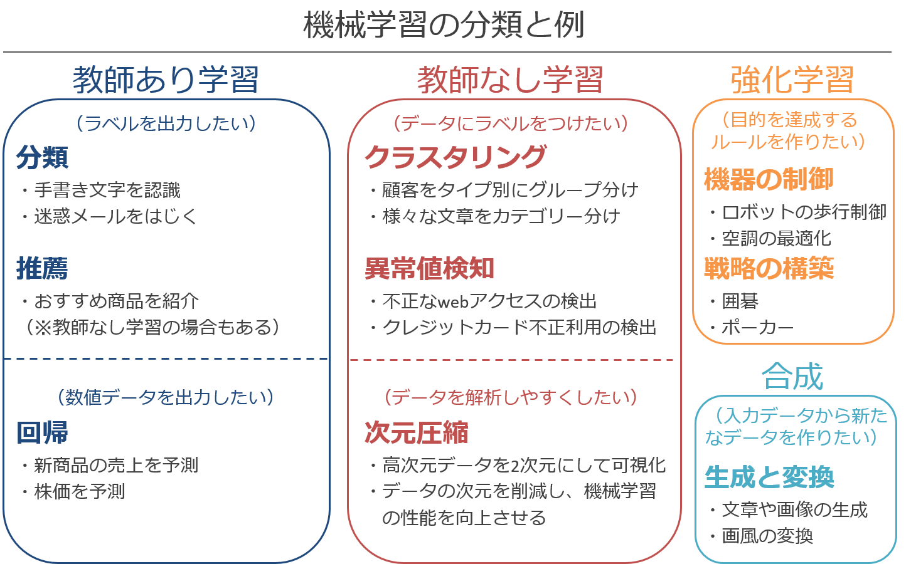
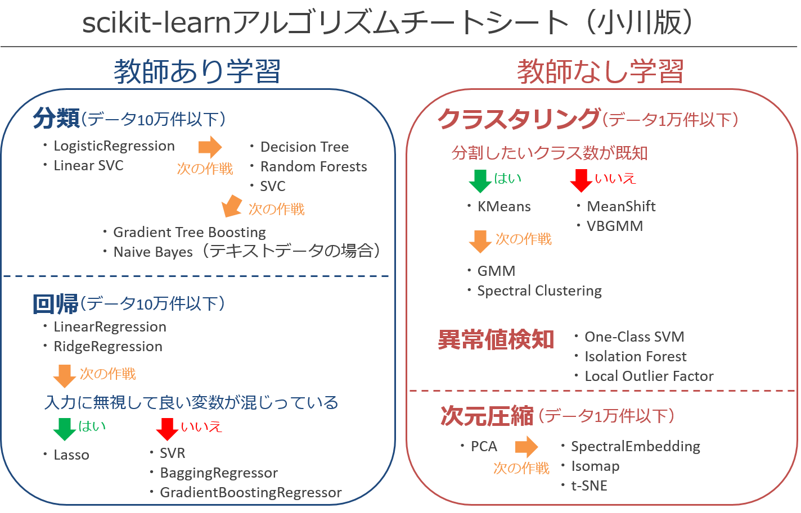

## scikit-learnで学ぶ機械学習アルゴリズム（Software Design 2018.04～）

本リポジトリは、筆者が「Software Design」で執筆・共著した記事の実装コードを公開しています。

### 1. 機械学習分類マップ

### 2. scikit-learnのアルゴリズムチートシート

### 3. 実装コード
#### 教師あり学習
##### 分類
- ロジスティック回帰[（実装コード）](https://github.com/YutaroOgawa/scikit-learn_tutorial_SoftwareDesign/blob/master/program/logistic_regression_SD1804.ipynb)
  
##### 回帰
- 線形回帰と正則化[（実装コード）](https://github.com/YutaroOgawa/scikit-learn_tutorial_SoftwareDesign/blob/master/program/linear_model_SD1805.ipynb)

#### 教師なし学習
##### クラスタリング
- KMeans[（実装コード）](https://github.com/YutaroOgawa/scikit-learn_tutorial_SoftwareDesign/blob/master/program/KMeans_SD1807.ipynb)

##### 次元圧縮
- 主成分分析[（実装コード）](https://github.com/YutaroOgawa/scikit-learn_tutorial_SoftwareDesign/blob/master/program/PCA_SD1806.ipynb)

### 4. 著者紹介
- 小川雄太郎
- 著者情報の詳細はこちら　https://github.com/YutaroOgawa/about_me
- official.yutaro.ogawa@gmail.com
